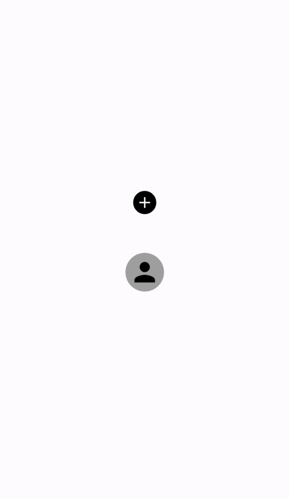

<!--
This README describes the package. If you publish this package to pub.dev,
this README's contents appear on the landing page for your package.

For information about how to write a good package README, see the guide for
[writing package pages](https://dart.dev/guides/libraries/writing-package-pages).

For general information about developing packages, see the Dart guide for
[creating packages](https://dart.dev/guides/libraries/create-library-packages)
and the Flutter guide for
[developing packages and plugins](https://flutter.dev/developing-packages).
-->

# profile_image_selector
This widget allows the user to select an image from the gallery and display the cropped image. The widget can only be shaped as a perfect circle, and the size can be a natural number greater than 30.

This widget uses these packages:
- [image_picker: ^1.0.1](https://pub.dev/packages/image_picker/example)
- [image_cropper: ^5.0.0](https://pub.dev/packages/image_cropper)

So please follow the installation guide to complete the configuration before importing this package.

## Getting started
Please install/import this package after completing the configuration according to the installation guides for image_picker and image_cropper.

## Usage
This widget allows users to select/crop a photo from their gallery and display it as their profile picture. When the user taps the widget, the picker selects an image, crops the selected image, and displays it on the screen.

You can specify values for the following properties :.
- size:widget size
- icon:Icon to display when imageFile is null
- backgroundColor :Color of the perfect circle
- iconColor:Icon color

## Example
```dart
Scaffold(
      body: Center(
        child: Column(
          mainAxisAlignment: MainAxisAlignment.center,
          children: [
            //size,icon,backgroundColor,iconColor is specified
            ProfileImageSelector(
              size: 30,
              icon: Icons.add,
              backgroundColor: Colors.black,
              iconColor: Colors.white,
            ),
            const SizedBox(
              height: 50,
            ),
            //only size is specified
            ProfileImageSelector(size: 50),
          ],
        ),
      ),
    );
```
